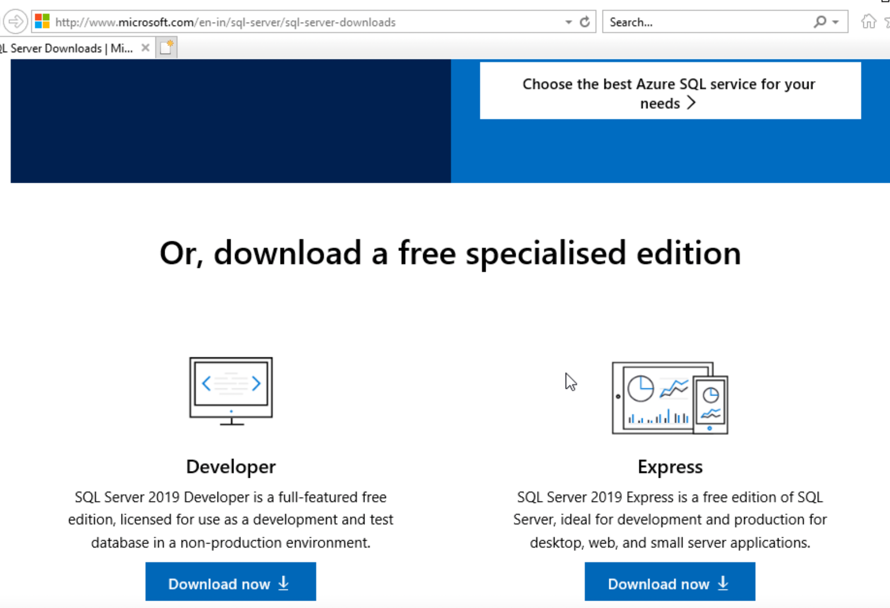
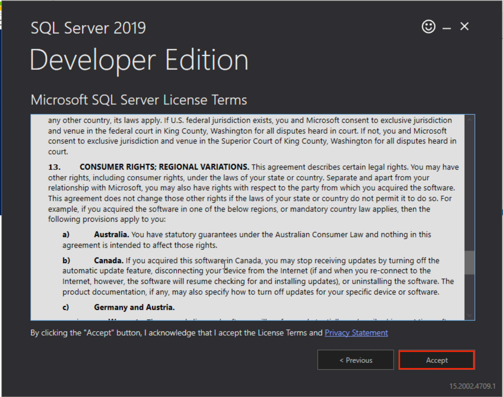
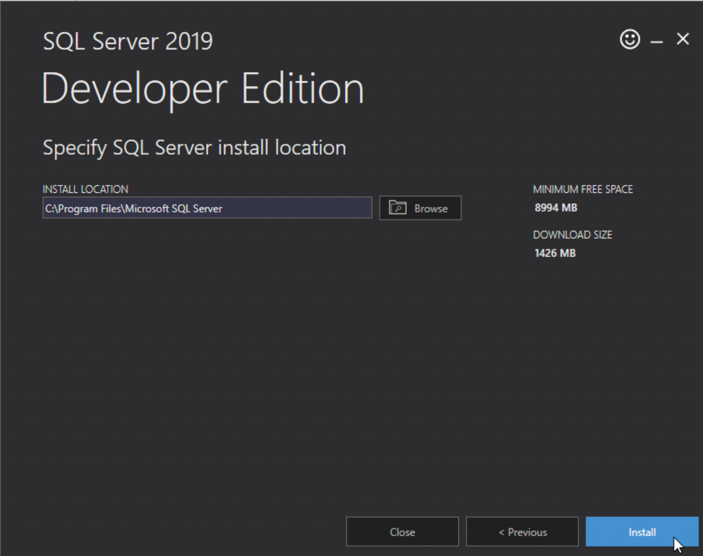
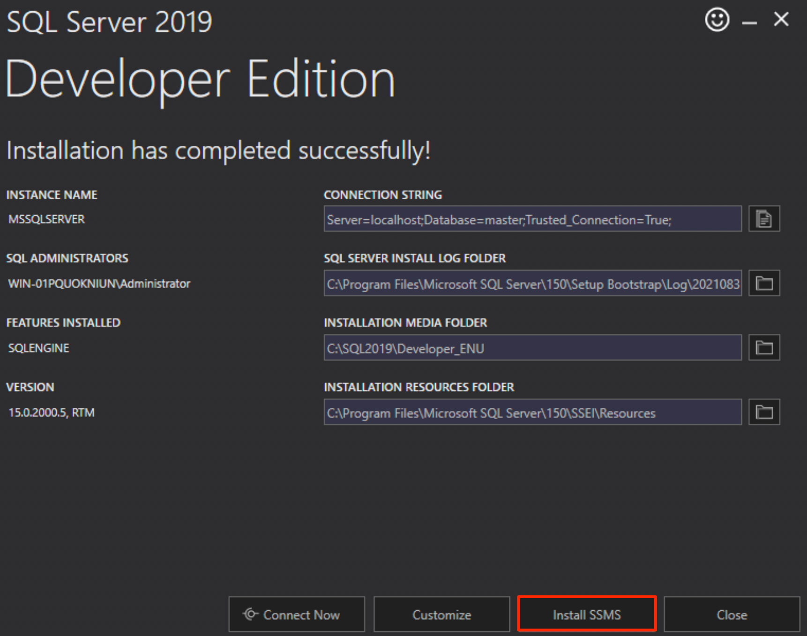
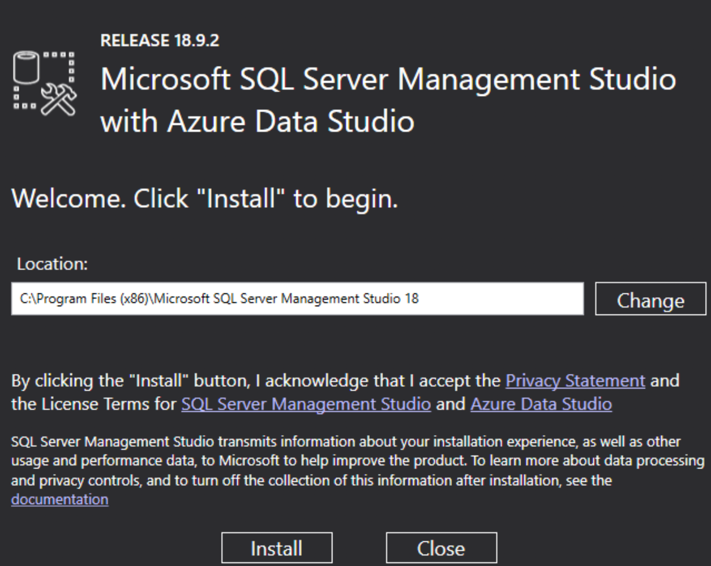
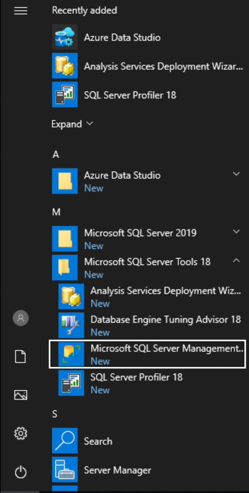

This is a step-by-step guide for installing MS SQL Server 2019 (latest at the time of writing this document) and SSMS 18.9.2 for Windows OS.

Refer the [Prerequisite](1-prerequisite.md) section before you proceed.

## Download MS SQL Server for Windows

Click [here](https://www.microsoft.com/en-us/sql-server/sql-server-downloads) to go to the SQL Server Downloads link.
Scroll down and choose between the **Developer** edition or **Express** edition.

   This guide uses the *Developer* edition for development and testing in a non-production environment.

## Install MS SQL Server

1. Click on the **Download now** button for the *Developer* edition.
1. Next, double click **SQL2019-SSEI-Dev** from your installed location to start the installer.

1. Select the recommended **Basic** installation type.

1. Click **Accept** to accept the License agreement.

1. You can select the default install location, or change the location by clicking on the **Browse** button.

Click **Install**.
1. An installation complete screen summarizes the database details.

 You may want to make a note of the following information on the screen - Instance name, connection string, log folder path, sql engine path, and the installation resources folder path.

## Install SSMS

1. On the SQL Server 2019 completion screen, click **Install SSMS**.
1. On the download page, scroll down and click on **Download SQL Server Management Studio (SSMS)**.

1. Double click the **SSMS-Setup-ENU.exe** executable from your download location.

1. The default download location is indicated. To select a different location, click the **Change** button.

Click **Install**.

Once SSMS is successfully installed, click **Restart**.

Congratulations ! You have successfully installed MS SQL Server 2019 and SQL Server Management Studio (SSMS) 18.9.2 on Windows.

### Connect to SQL Server Database Engine

1. Click **Start** and search Microsoft SQL Server Management Studio or SSMS.

1. From the *Object Explorer* panel on the left, click **Connect**.
1. In the **Connect to Server** dialog box, click **Connect** with the default server values.

In this case, *Server name* is your machine name.

1. You are now connected to MS SQL system database, as indicated with a green arrow in the screenshot.

## Next Steps

Create a database, create table(s), and issue T-SQL commands on the SQL database.
