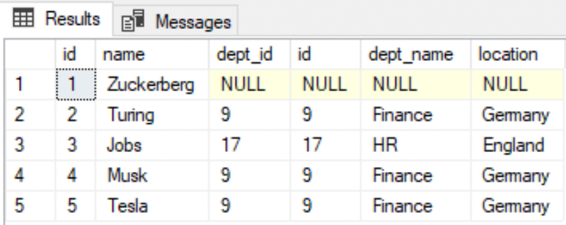
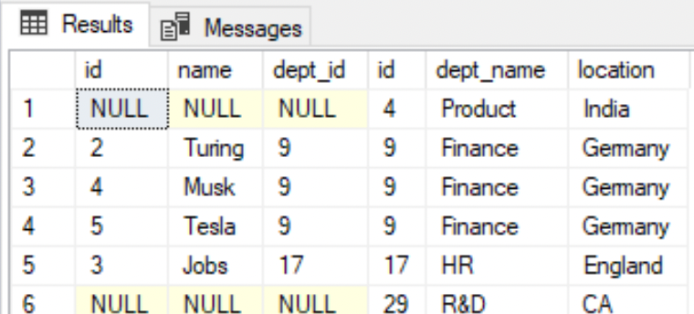
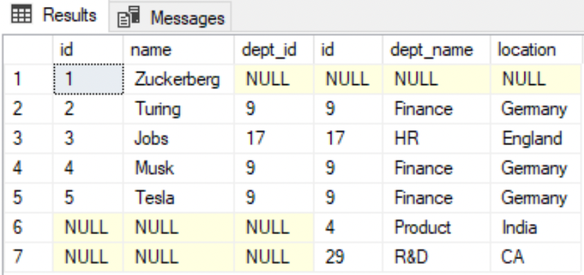
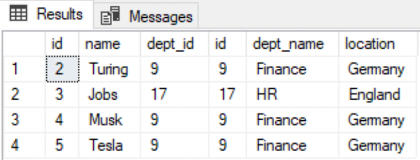

T-SQL statements use joins to retrieve data from two or more tables.
You can use joins in the `FROM` or `WHERE` clause.

## Syntax

```SQL
SELECT <arguments> FROM <first_table>
[ LEFT | RIGHT | INNER ] JOIN <second_table>
ON <join_condition>
```

* `<arguments>`: use `*` to select all rows, or use column name(s) to retrieve selected columns.
* `<first_table>`: First table name
* `<second_table>`: Second table name
* `<join_condition>`: condition on which the two tables have a matching pair. This condition has to evaluate to true.

## Pre-requisite

* MSSQL Server
* SQL Server Management Studio (SSMS)

## Prepare the tables

1. Create the tables

```SQL
--Use the 'HASURA' database that you created
USE HASURA;
GO

--Create the first table
CREATE TABLE EMPLOYEE(
	id int PRIMARY KEY,
	name VARCHAR(10) not null,
    --foreign key reference to 'id' column from the 'department'
	dept_id int FOREIGN KEY REFERENCES dbo.DEPARTMENT (id) NULL
);

--Create the second table
CREATE TABLE DEPARTMENT(
id int PRIMARY KEY,
dept_name VARCHAR(10),
location VARCHAR(10)
);
```

2. Insert data

```SQL
--Begin by entering into the 'DEPARTMENT' table first respecting the foreign key reference
INSERT INTO DEPARTMENT VALUES (29, 'R&D', 'USA');
INSERT INTO DEPARTMENT VALUES (17, 'HR', 'England');
INSERT INTO DEPARTMENT VALUES (9, 'Finance', 'Germany');
INSERT INTO DEPARTMENT VALUES (4, 'Product', 'India');

--Insert into the 'EMPLOYEE' table
INSERT INTO EMPLOYEE VALUES (1, 'Zuckerberg', NULL);
INSERT INTO EMPLOYEE VALUES (3, 'Jobs', 17);
INSERT INTO EMPLOYEE VALUES (2, 'Turing', 9);
INSERT INTO EMPLOYEE VALUES (4, 'Musk', 9);
INSERT INTO EMPLOYEE VALUES (5, 'Tesla', 9);
```

3. See the result sets of both the tables.

```SQL
SELECT * FROM EMPLOYEE;

SELECT * FROM DEPARTMENT;
```

## LEFT JOIN

```SQL
--All employees, including the ones that do not have a department assigned are listed.
SELECT * FROM EMPLOYEE e 
LEFT JOIN DEPARTMENT d
ON e.dept_id=d.id;
```



## RIGHT JOIN

```SQL
--All departments are listed, but only the employees that have a matching dept_id are shown
SELECT * FROM EMPLOYEE e 
RIGHT JOIN DEPARTMENT d
ON e.dept_id=d.id;
```



## FULL JOIN

```SQL
--All employee and department rows are listed including the ones with no matching records
SELECT * FROM EMPLOYEE e 
FULL JOIN DEPARTMENT d
ON e.dept_id=d.id;
```



## INNER JOIN

```SQL
--Retrieve only the matching rows from both the tables
SELECT * FROM EMPLOYEE e
INNER JOIN DEPARTMENT d
ON e.dept_id=d.id;
```



The keyword `INNER` is optional.
If you omit this and just use `JOIN` alone, the join defaults to the type `INNER JOIN`.
