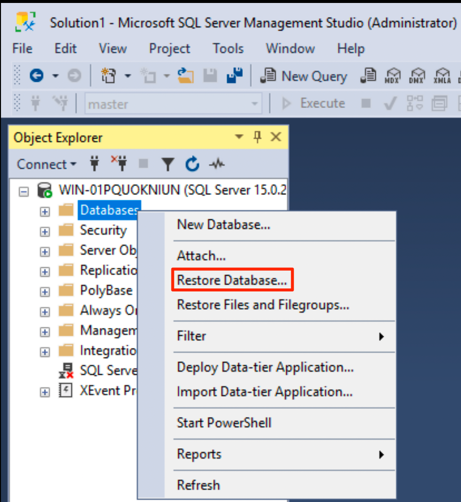
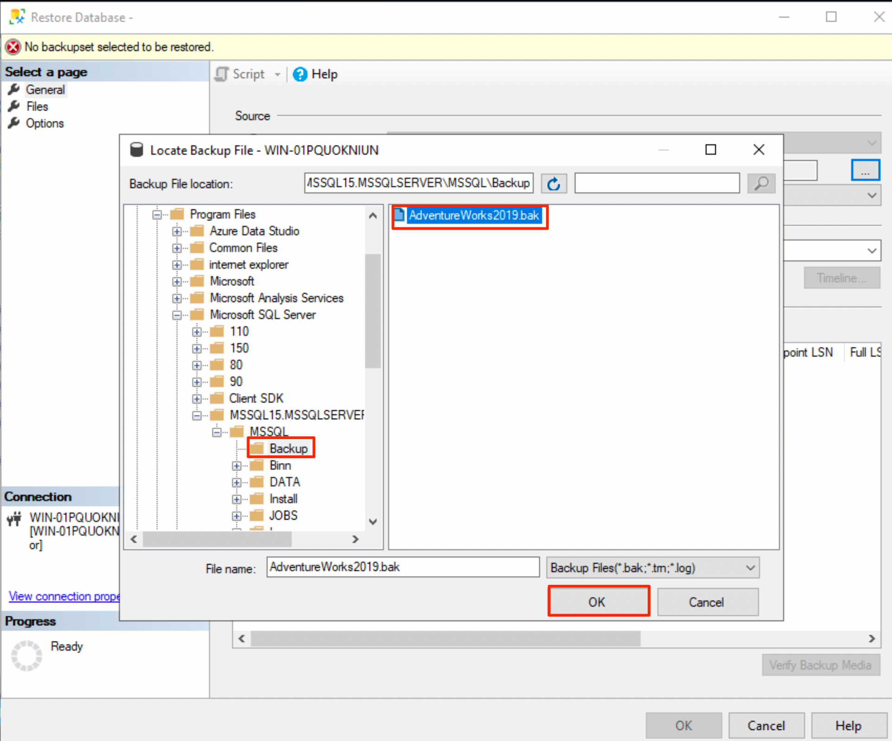
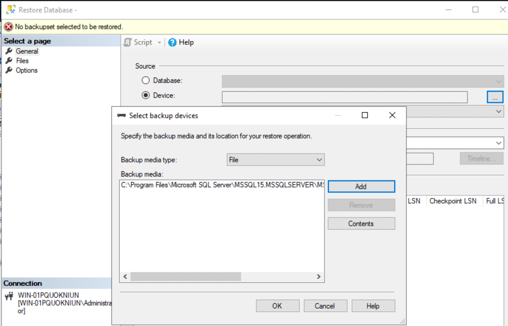
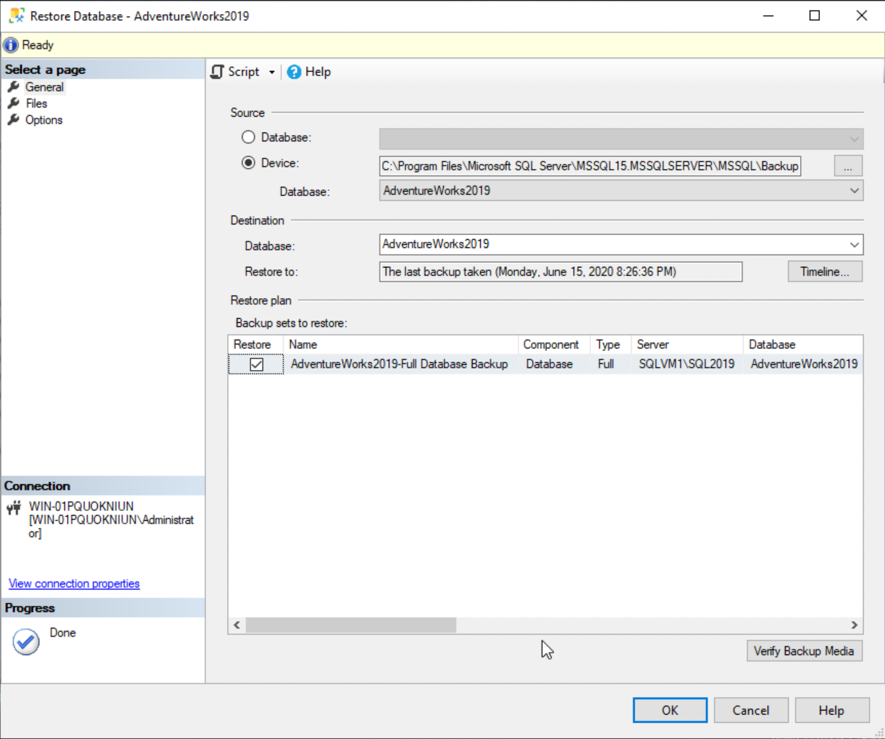

In this section, you will restore a database from a backup file into your SQL Server database.

## Pre-requisite

* MSSQL Server
* SQL Server Management Studio (SSMS)
* A database restore file stored in the default backup location. ( As explained in the download sample database section of the [select page](core-concepts/t-sql-statements/4.select.md) ).

## Restore a database

1. Open SQL Server Management Studio (SSMS), and connect to your database.
1. In **Object Explorer** on the left, right-click **Databases > Restore Database...** to launch the **Restore Database** wizard.

   )

1. Select **General > Device**.
1. Select the 3 eclipses `...` next to Device.

    

1. Locate the **AdventureWorks2019.bak` file from the default location, and click **OK**.

    

1. Select **Add** to add the **Backup media** file.
1. Click **OK** to confirm your database backup selection and return to the main wizard.

    

1. Select **OK** to restore your database.

**AdventureWorks2019** sample database is now available in the **Object Explorer**.
